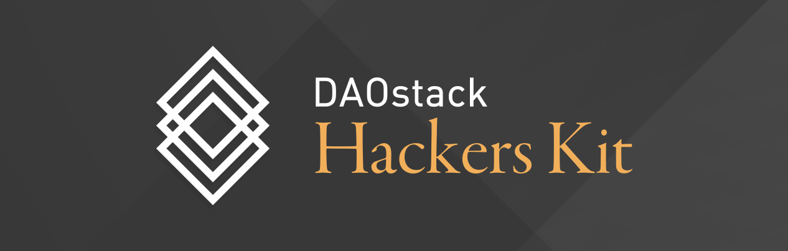

Refer to developer docs and tutorials at [DAOstack dev portal](https://daostack.github.io/DAOstack-Hackers-Kit)

# Table of contents

<!--ts-->

- [Introduction](#introduction)
- [The Stack](#the-stack)
  - [Infra](#infra)
  - [Arc](#arc)
  - [Client](#client)
  - [Subgraph](#subgraph)
  - [Dapps](#dapps)
  - [DAOs](#daos)
- [Examples](#examples)
- [Contact and Help](#contact-and-help)
  <!--te-->

# Introduction

Welcome to the DAOstack Hackers Kit! This repository was created to help you get started building on the DAOstack platform.

[DAOstack](https://daostack.io) is a software stack for building Dapps (decentralized apps), DAOs (Decentralized Autonomous Organizations), and DAO tools.

The DAO stack provides all infrastructure needed to build such projects, including: 
 - [Infra](https://github.com/daostack/infra), an Ethereum library of fundamental decentralized decision-making components 
 - [Arc](https://github.com/daostack/arc), an Ethereum library containing everything needed to deploy DAOs
 - [Migration](https://github.com/daostack/migration), a library of utilities required to migrate DAOstack contracts and DAOs and other tools for migration related tasks
 - [Client](https://github.com/daostack/client), a JavaScript library for interacting with Arc smart contracts and frontend library for the DAOstack subgraphs
 - [Subgraph](https://github.com/daostack/subgraph), a Caching layer to index blockchain data that can be queried via GraphQL
 - [Alchemy](https://alchemy.daostack.io/) and other collaborative Dapps for end users to interact with
 - [Genesis](https://alchemy.daostack.io/), DAOstack's own community DAO, which exists to help promote and fund the DAO ecosystem

Here in the Hackers Kit you can find examples and details on how to use the DAO stack as well as links to documentation and other helpful resources. This repo, as well as code from any other [DAOstack repo](https://www.github.com/daostack), may be used to build your own ideas and applications.

If you need a more general primer on the DAOstack project, read [here](https://medium.com/daostack/an-explanation-of-daostack-in-fairly-simple-terms-d0e034739c5a) before continuing.

# The Stack

## [Infra](https://github.com/daostack/infra)

**Infra is a Solidity smart contract library containing the core building blocks of decentralized governance.** Infra contracts can be integrated into any application regardless of its architecture.

Infra has two main components:

- **Voting Machines** - A voting machine is a universal contract which can operate the voting process for any organization. Each voting machine follows its own predifined rules for the decision making and execution process. Rules for voting machines can be implemented for any voting process, from a simple protocol like an "Absolute Vote" (where 51% of the voting power should approve it in order for the decision to pass), or more sophisticated protocols like the [Holographic Consensus](https://www.youtube.com/watch?v=1De0MoStSkY) voting protocol.

- **Voting Rights Management** - A voting rights management system determines how voting rights are distributed. Any voting rights management system must have "balances" which represents the voting power each participant holds. There are 2 main approaches for managing voting rights: token-based voting and reputation-based voting. The main technical difference between the two is that tokens are transferable (i.e. tradable) while reputation is non-transferable. Another big difference which may appear (depending on implementation) is that a token is a property which cannot be taken while reputation may be redistributed by the organization itself. For most cases, we reccomend using the reputation-based voting model, however, Infra allows any voting right management system to be built.

### Should I work at this level?

Build on Infra if you need new or modified decentralized governance primitives, such as voting machines and voting rights management systems.

## [Arc](https://github.com/daostack/arc)

**Arc is a Solidity smart contract library for building DAOs.** To get a good understanding of how the Arc framework is built, you can go to [this blog post](https://medium.com/daostack/the-arc-platform-2353229a32fc). Arc uses Infra to provide decentralized organizations with voting machines and voting rights management systems.

DAOs built with Arc have a few basic contract components:

- **Avatar** - The DAO's "account." This contract represents the address of the DAO and holds its assets.
- **Reputation** - Voting in Arc is done mainly using Reputation. Reputation can be distributed and redistributed only by DAO decision, and it is generally given (via vote) to an agent according to their performance and contribution to a DAO.
- Token - Each DAO may have its own token, which can be used in any way the DAO would like.
- **Controller** - The controller is the "Access Control" of the DAO, managing who can interact with which DAO functions and enforcing the DAO's constraints.
- **Schemes** - Schemes are a DAO's "actions": anything a DAO should act upon needs to be written and authorized by the controller as a scheme. Schemes might be used to help a DAO: propose and make investments, give reputation to agents, upgrade the DAO's contracts, register new schemes and constraints, etc.
- **Global Constraints** - Global constraints are limitations on a DAO's actions. When executing a scheme, the controller checks the constraints to see if the action violates them, and blocks the execution if it does. Some examples for constraints might be: the token supply can't be increased over 1M tokens, the organization won't use more than 60% of its funds at once, etc.

**Arc utilizes the concept of "Universal" contracts**: contracts which are deployed once, and then can be used by any number of DAOs simultaneously, saving gas and deployment costs. Schemes and constraints can both be used in this way. To use the already deployed contracts, you can either use Client, which maintains easy access to all universal Arc contracts, or you can use [Migration.json](https://github.com/daostack/migration/blob/master/migration.json) to view the addresses of the universal contracts of the latest arc version on the mainnet, Kovan, Rinkeby and Ganache\*
All contracts listed in the file are universal, meaning that users should use them when needed and not redeploy them.

_\* Please note that the Ganache addresses are based on the DAOstack commands for running and deploying Arc to a local Ganache network, which means those addresses might change if you are using a different method to run Ganache or deploy Arc._

### Should I work at this level?

Using Arc is not necessary to deploy a DAO (you can do this with [Migrations](https://github.com/daostack/migration) currently and in the future as an end user of Dapps), but you might want to work on this layer if you need your DAO to have a unique action, constraint, or voting process that is not yet implemented on Arc.

You can find the complete Arc docs here: [https://daostack.github.io/arc](https://daostack.github.io/arc)

## [Client](https://github.com/daostack/client)

**Client is a library that facilitates access to Arc contracts without having to directly interact with the Ethereum blockchain.** It provides functions to interact with DAOstack contracts to vote, propose, stake and execute proposals.

Client library is also a wrapper around [DAOstack subgraph](https://github.com/daostack/sugbraph). It enable developers to interact with subgraph and execute various generic graph queries to access proposals, daos and other complex entities

Using Client, JavaScript/TypeScript developers can easily write scripts or applications which can interact with existing DAOs, submit proposals to DAOs, vote and stake on proposals, execute the resulting decisions, manage agent reputations. This is particularly helpful for developers who want to get the advantages of decentralized governance on the blockchain without dealing directly with a smart contract language.

### Should I work at this level?

You should use Client whenever you want to use JavaScript or TypeScript to interact with Arc contracts for voting, proposing etc or to execute generic GraphQL queries on subgraph for accessing blockchain data. If you are interacting with custom Arc contracts or custom subgraph, then you might have to write your own Web3 library to interact with contracts and/or query the subgraph.

## [Subgraph](https://github.com/daostack/subgraph)
**Subgraph indexes the blockchain data and stores it in postgres database for easy and quick access.** The subgraph runs on a Graph Node which is a server that developers can run local or remote. The data store can be queried by GraphQL endpoints. [DAOstack subgraph](https://subgraph.daostack.io/) is based on graphprotocol, checkout [TheGraph](https://thegraph.com/docs/quick-start) for more details. TheGraph opens their server to others and you can find daostack subgraph and subgraphs from many other projects at [Graph Explorer](https://thegraph.com/explorer/)

### Should I work at this level?

If you are writing new Arc contracts which are not indexed by DAOstack subgraph or want to fetch data of existing Arc contracts in a way other than that specified in [DAOstack subgraph's schema.graphql](https://github.com/daostack/subgraph/blob/master/src), then you should write your own subgraph schema and mappings

## Dapps

The Client library facilitates development of "Dapps" (Decentralized applications) for interacting with DAOs.

**DAOstack has built its own Dapp called [Alchemy](https://alchemy.daostack.io/), a front-end interface for DAOs**, or more specifically, for budget management in decentralized organizations. Alchemy allows end users to make collaborative budgeting decisions and allocations using the [Holographic Consensus protocol](https://www.youtube.com/watch?v=1De0MoStSkY&feature=youtu.be&t=11m50s).

You can find the Alchemy repo at [github.com/daostack/alchemy](https://github.com/daostack/alchemy).

A second Dapp built by DAOstack is [Vanille](http://daostack.azurewebsites.net) (enable MetaMask). Vanille enables users to create and interact with DAOs before moving to a dedicated interface like Alchemy.

You can find the Vanille repo here: [https://github.com/daostack/vanille](https://github.com/daostack/vanille).

### Should I work at this level?

Build at the Dapp level if you want to create new ways to interact with existing DAOs and DAOstack smart contracts, e.g. a multi-DAO explorer for GEN predictors or a new DAO creation app.

## DAOs

**DAOs can be created for any conceivable collaborative purpose, from local political action to distributed manufacturing and sales.** The goal of DAOstack is to make it as easy as possible to create and manage DAOs, and to use them to drive a new decentralized global economy (specifically, an economy that uses [GEN, our collective attention token](https://medium.com/daostack/on-the-utility-of-the-gen-token-eb4f341d770e)).

**DAOstack Technologies has created an initial DAO called "Genesis" with the purpose of promoting the GEN/DAO ecosystem.** Genesis is currently live on the Ethereum mainnet, has over 100 Reputation-holders who have executed over 120 proposals since August 2018, and can be accessed through ["Alchemy"](https://alchemy.daostack.io/).

### How to launch a new DAO?

  The core contracts required by a daostack DAO are already deployed by the DAOstack team on mainnet as well as testnet and the addresses are available in [Migration.json](https://github.com/daostack/migration/blob/master/migration.json). Though you need to deploy an Avatar, custom schemes (optional), native reputation and native token contract. Checkout [Structure of DAO](https://github.com/daostack/arc#arc) for details on Avatar, scheme, rep and token
 
  DAO can be deployed using Migration package either from CLI or using javascript. Example deployment setup and scripts are available in [Starter-template](https://github.com/daostack/DAOstack-Hackers-Kit/tree/master/starter-template)

  - Choose a name for your DAO and the native token and its symbol
  - Do you want to use DAOcreator contract?
      Deploying a DAO with DAOcreator contract saves number of transactions to be signed by bundling up founder rep and token distribution (upto 100 members) in single tx and initial scheme registration in single tx

  - Which schemes to include in the DAO?

    Schemes are the actions a DAOstack DAO can take when a proposal passes/fails. Currently supported schemes in Migrations package are:

    - ContributionReward: Enables fund management proposals that distribute funds to beneficiary once the proposal passes
    - GenericScheme: Enables Avatar to make arbitrary function calls to a specific contract. For eg use Avatar to submit a proposal to Genesis Alpha on behalf of your DAO
    - SchemeRegistrar: Lets you submit a proposal to register more schemes (apart from initial schemes set at time of deployment) to the DAO
    - GlobalConstraintRegistrar: Lets you submit a proposal to register more GlobalConstraints
    - UpgradeScheme: Lets you upgrade the controller. Since Controller is not a Scheme it cannot be changed via SchemeRegistrar

    Find detailed documentation re Schemes in [Arc Repo](https://github.com/daostack/arc)

  - Ucontroller vs Controller?
    Refer to documentation on Controllers
        
  - Decide on which Voting Machine to use and the parameters
    Set the voting machine parameters according to the needs of the organization. Currently you can deploy a DAO using migrations with only GenesisProtocol voting machine, which allows decision at timeout according to higher relative vote. You can find details about different voting machines supported by arc at https://github.com/daostack/arc/tree/master/docs/contracts/VotingMachines

  - Who gets the initial rep and token in DAO?
    Edit the list of founder members’ address along with the rep and/or token to be distributed initially. You may choose to give equal rep to all or have differentiated rep.

    Once you have decided on *dao-params* follow the instruction in *Migrations* or one of the examples to deploy your dao

# Examples
The hackers kit is equipped with several examples and sample projects, which we are working to maintain and expand. The goal for these examples is to help developers easily kickstart a new project, as well as to demonstrate some of the features included in each layer of the DAO stack.

## [Starter Template](https://github.com/daostack/DAOstack-Hackers-Kit/tree/master/starter-template)
This is a basic template you can use for kickstarting your project using the DAOstack platform. Here you can find the basic structure for using Arc, Client and Subgraph to build your project.

## [Peep DAO](https://github.com/daostack/DAOstack-Hackers-Kit/tree/master/peepeth-dao-example)
This project is a Dapp for interacting with a DAO which has its own DAO social media account on [Peepeth](Peepeth.com), a decentralized microblogging app. The Dapp allows a DAO post Peeps via a decentralized voting mechanism.

## [DutchX DAO Bootstrap](https://github.com/daostack/DAOstack-Hackers-Kit/tree/master/dutchx-bootstrap)
This project contains a minimal UI for participating in the bootstrap of the DutchX DAO.
The bootstrapping process for a DAO is the process of distributing its initial reputation and tokens. The DutchX bootstrap process is a 3 months period during which users can do several actions, like locking tokens, in order to receive Reputation in the DutchX DAO.
You can view the DutchX DAO bootstrapping contracts [here](https://github.com/daostack/arc/tree/master/contracts/schemes).

## [Firestarter DAO Example](https://github.com/daostack/DAOstack-Hackers-Kit/tree/master/firestarter-example)
Firestarter is a community driven crowdsourcing platform, which utilizes DaoStack for governance of the projects.
This is a striped down version of the project, which only showcases the DaoStack integration.

# Contact and Help

DAOstack team members and open-source community members always make an effort to assist new projects.
For any technical questions, please reach out to us via Discord [at this link](https://discord.gg/cHZ8Ha9).
If you have any questions or comments about this repository, please open an issue, and we'll do our best to help.
