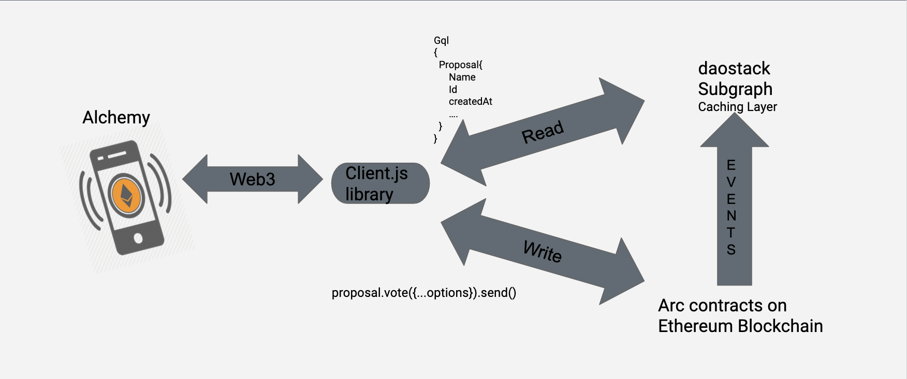

# Developing With Alchemy

## Prerequisites

  - docker >= 18.06.1-c
  - docker-compose >= 1.22.0
  - node >= 10.16.0
  - npm >= 6.9.0
  
## Overview
  Alchemy uses [Client.js](../../stack/client/clientIntro) for 
  
  - reading/inferencing blockchain data via [DAOstack Subgraph](../../stack/subgraph/subgraphIntro)
  - writing/modifying state of [Arc contracts](../../stack/arcIntro/)

  Following figure shows interaction of Alchemy with rest of the stack

  

## Boilerplate

    git clone https://github.com/daostack/alchemy.git
    cd alchemy
    npm ci

## Setup Alchemy with Ganache (mode: development)

    docker-compose build
    docker-compose up -d

  The above commands will build docker images and start the following services locally:

  - **alchemy** => react frontend with webpack-dev-server
  - **alchemy-server** => for storing proposal information for quick access
  - **graph-node** => for handling events from blockchain as described in subgraph
  - **ganache** => dev blockchain with some test DAOs deployed and loaded with GEN and Eth
  - **subgraph-ipfs** => subgraph mappings on ipfs node
  - **subgraph-postgres** => db for caching events based on subgraph and later fetched via GraphQL
  - **redis**
  - **alchemy-postgres**

  Import test accounts that are setup with GEN and ETH to your metamask. You can get the account details by:

    docker logs alchemy_ganache_1 | head -35

  Now your playground is ready for developing.

  TODO: Currently webpack does not detect changes in all components and rebuilds only if top-level `src/file` is changed. For now you can touch the any file in top-level and this should trigger rebuild

  NOTE:

  1. If the feature integration requires you to interact with outside contracts (e.g. uniswap widget integration would require uniswap contracts), then you can simply deploy those contracts to same `ganache` container using truffle or your own deployment script.
  2. See `Client.js` documentation for more integration details

## Setup Alchemy with Testnet (mode: staging)

  After the boilerplate steps you would need to change the `docker-compose.yml`, `webpack.docker.config.js` and `.env`

  Choose from one of the following setup for testnet to start playing and integrating features to Alchemy:
  
  - [Use daostack rinkeby subgraph](#use-daostack-rinkeby-subgraph)
  - [Run graph-node locally with already supported schemes](#run-graph-node-locally-with-already-supported-schemes)
  - [Run  graph-node locally with new/not yet supported schemes](#run-graph-node-locally-with-newnot-yet-supported-schemes)

  
### Use daostack rinkeby subgraph

  Choose this if,

  - using rinkeby testnet
  - working with existing whitelisted DAOs on daostack subgraph

  Make following changes:

  1. Update `docker-compose.yml`
        - remove link to `graph-node` in service `alchemy`
        - remove services `graph-node`, `ipfs`, `postgres4graphnode` and `ganache`
  2. Update `webpack.docker.config.js`
        - Change `NODE_ENV` from `development` to `staging`
  3. Build and run
        
          docker-compose build
          docker-compose up -d

### Run graph-node locally with already supported schemes

  Choose this if,

  - using any of the already supported schemes by client & alchemy
  - playing with DAO you just deployed and to any of the testnet and not yet whitelisted by daostack
  - using any testnet

  Make following changes:

  1. Clone subgraph repo and start-graph node locally

        git clone git@github.com:daostack/subgraph.git
        cd subgraph
        npm i

        touch .env
        echo network="network-name" >> .env # eg "rinkeby"
        echo subgraph="subgraph-name"
        echo postgres_password="letmein"
        echo ethereum_node="https://rinkeby.infura.io/v3/e0cdf3bfda9b468fa908aa6ab03d5ba2"

        npm run docker:run-rinkeby 

  2. Update your DAO details and deploy subgraph

        touch daos/rinkeby/<DAO-Name>.json
        # Add your DAO details in `<DAO-Name.json> file
        # refer to any of existing file in daos/rinkeby folder
        npm run deploy '{  "migrationFile" : "../migration.json" }'
        
  3. Update `docker-compose.yml`
        - remove link to `graph-node` in service `alchemy`
        - remove services `graph-node`, `ipfs`, `postgres4graphnode` and `ganache`

  4. Update `webpack.docker.config.js`, add following process variables
        'ARC_GRAPHQLHTTPPROVIDER': JSON.stringify('http://127.0.0.1:8000/subgraphs/name/daostack'),
        'ARC_GRAPHQLWSPROVIDER': JSON.stringify('ws://127.0.0.1:8001/subgraphs/name/daostack'),
        'ARC_IPFSPROVIDER': JSON.stringify('localhost')

  5. Build and run
        
          docker-compose build
          docker-compose up -d

   Note: You can also deploy subgraph to graph explorer. `Step 1 & 2` will be replaced by [deploy to graph-explorer](https://github.com/daostack/subgraph#deploy-subgraph)
   and `Step 4` will be updated to have corresponding url

### Run  graph-node locally with new/not yet supported schemes
