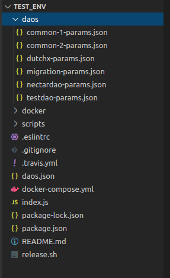

# Registering a Plugin in Test-Env

## 1. Adding the Plugin information to a test DAO

To test the registered plugin, it must be added to the test environment. The environment used to test Alchemy and Arc.js.

In order to do that, first choose one of the DAOs for testing that already exist in the test-env repo, which are just JSON files with configuration parameters:



For the sake of this example, we will use the `TestDAO`, to register the `TokenTrade` Plugin.

The `"Schemes"` key of the `testdao-params.json` file contains an array. In this array add a new object with the following structure:

- **name**: `string` with the plugin's name. In this case, it would be "TokenTrade".
- **alias**: `string` with the plugin's alias. In this case, it would be "Token Trade".
- **permissions**: `string` that represents the permissions hash for the plugin initialization. In this case it would be "0x00000000".
- **params**: `array` that contains the initialize parameters to be passed to the `initialize` method of the plugin's contract. In this case it would be

```
[
  "GenesisProtocolAddress",
  { "voteParams": 0 }
]
```

So the JSON file would look like this:

```json
{
  "orgName": "DAO For Testing",
  "tokenName": "DAO For Testing Token",
  "tokenSymbol": "DxFT",
  "VotingMachinesParams": [...],
  "Schemes": [
    {
      "name": "ContributionReward",
      "alias": "Funding And Voting Power",
      "permissions": "0x00000000",
      "params": [
        "GenesisProtocolAddress",
        { "voteParams": 0 }
      ]
    },
    {
      "name": "TokenTrade",
      "alias": "Token Trade",
      "permissions": "0x00000000",
      "params": [
        "GenesisProtocolAddress",
        { "voteParams": 0 }
      ]
    },
    {
      "name": "SchemeRegistrar",
      "alias" : "Plugin Manager",
      "permissions": "0x0000001F",
      "params": [
        "GenesisProtocolAddress",
        { "voteParams": 1 },
        { "voteParams": 1 }
      ]
    },

    ...
```

## 2. Bumping the test-env version

Next, go to the `package.json` file and change the package version:

```json
{
  "name": "@daostack/test-env-experimental",
  "version": "4.0.20",
  "description": "Testing environment for DAOstack projects.",
  "main": "index.js",
  ...
}
```

## 3. Release the new test-env with the newly registered plugin

Run the `release.sh` script file, that exists at the repository's root folder. This will output some logs to the console and prompt for npm authentication to publish the new package.

This script will release a new version of the 3 test-env docker images and a new version of the test-env npm package.

## 4. Using the new test-env in Alchemy/Arc.js

In Alchemy/Arc.js codebase, change the test-env image versions in the `docker-compose.yml` file, so that they match the resulting version numbers from the previous step:

```yml
  ...

  ipfs:
    image: daostack/test-env-ipfs:3.0.38
    ports:
      - 5001:5001

  postgres:
    image: daostack/test-env-postgres:3.0.38
    ports:
      - 9432:5432
    environment:
      POSTGRES_PASSWORD: 'letmein'

  ganache:
    image: daostack/test-env-ganache:3.0.38
    ports:
      - 8545:8545
```